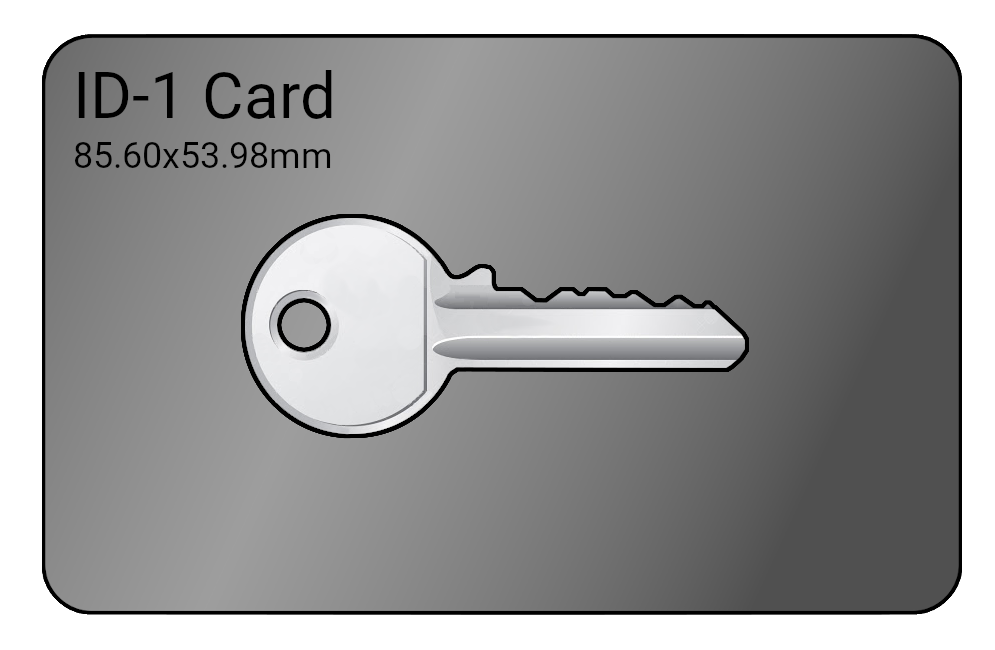
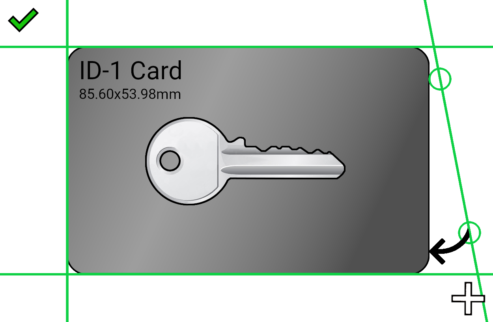
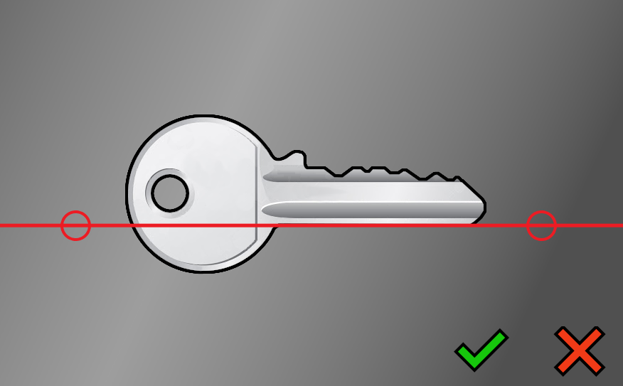
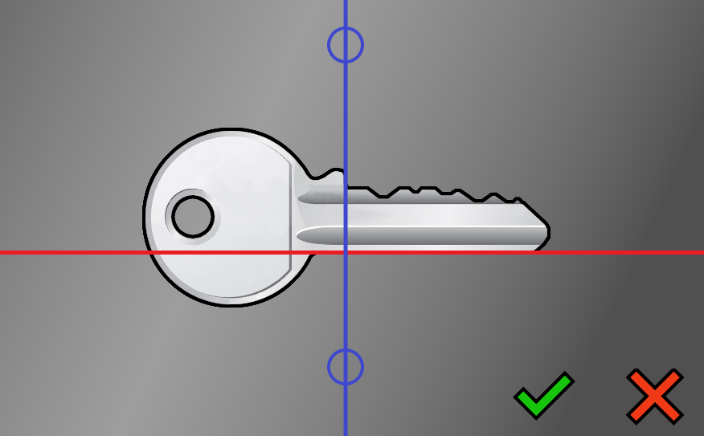
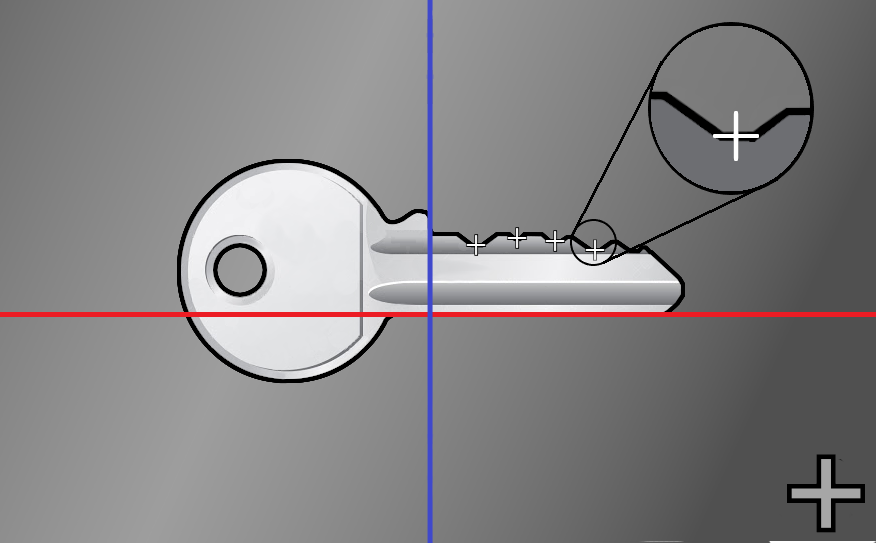

# KeyDecoder

<p align="center">
 
</p>

[](https://ats1851.com/en/about/) &nbsp;&nbsp;&nbsp;&nbsp;&nbsp;&nbsp;[](https://www.esiea.fr/expertise-confiance-numerique-securite/)

**KeyDecoder** is a mobile app created for pentesters and security enthusiasts.
From the picture of a key, one can measure its bitting easily.

Developped by *Maxime BEASSE* and *Quentin CLEMENT*.

In partnership with [FrenchKey](https://intrusion.eu/en/home/) and [CNS](https://www.esiea.fr/expertise-confiance-numerique-securite/) from [ESIEA](https://www.esiea.fr/).

Powered by [Flutter](https://flutter.dev) and [OpenCV (4.3.0)](https://opencv.org/)

# Summary

<!--ts-->
   * [KeyDecoder](#keydecoder)
   * [Summary](#summary)
   * [Disclamer](#disclamer)
   * [Installation](#installation)
      * [Build](#build)
        * [Android](#android)
        * [IOS](#ios)
      * [Releases](#releases)
   * [Usage](#usage)
      * [Take Picture](#take-picture)
      * [Cropping](#cropping)
      * [Back line](#back-line)
      * [Shoulder line](#shoulder-line)
      * [Measurements](#measurements)
   * [FAQ](#faq)
   * [License](#license)
<!--te-->

# Disclamer

## Making keys without consent is illegal.

This Key Decoding application is only meant for legal use. If you have unlawful intentions, your are not allowed to used this application.
To limit the risk of illegal use, an ISO sized card is necessary to decode a mechanical key, and the key must be taken off from its keyring.
We will provide no help nor assistance to any user that we believe is willing to commit a crime or a felony. 

## Educational and Consulting use only.

This Key Decoding app is meant to be used by Pentesters during their audits, to explain their clients how easily a criminal can duplicate keys (from picture, by molding or simply by asking a local locksmith to make a duplicate). Fair use is allowed if used by security enthusiasts, to assess their own security, and discover the difficulty of making keys only using a picture. 
The authors DO NOT ALLOW any users to sell keys created with the help of this app. Rulebreakers are subject to lawsuit.

## Security advice.

If you want to protect yourself from having your keys duplicated without your consent (with a picture, or by molding, or more simply by someone asking a locksmith to make a copy), you are invited to apply the same best practices to your keys as you do with your Credit Card or your Password. Just like credit cards and passwords, you must not lend your keys, or leave them unattended.

<p align="center" style="font-size:30px">
<strong>Have Fun, Stay Legal, Hide your keys.</strong>
</p>

*****

# Installation

## Build

* Download [Flutter SDK](https://flutter.dev/docs/get-started/install)

### Android

* Download [OpenCV v4.3.0](https://sourceforge.net/projects/opencvlibrary/) 
* Create the `local.properties` file under `android/`, providing the following settings :
```sdk.dir=<Android SDK path>
flutter.sdk=<Flutter SDK path>
flutter.buildMode=release
flutter.versionName=1.0.0
flutter.versionCode=1
opencv.sdk=<OpenCV Android SDK path>
```
* Build the project using `flutter build apk`

### IOS

*IOS is not currently supported*

## Releases

The most recent builds can be found in the repository [Releases](https://github.com/MaximeBeasse/AppKeyDecoder/releases).

# Usage

## Take Picture

Take a picture of a key, removed from its key ring, and place in the middle of an ISO/CEI 7810 ID-1 sized card (credit card, business card...). 
It is very important that the card measures exactly 85,60 by 53,98 mm.

<p align="center">
 
</p>

*A well lightened and high res picture will give better results.*

## Cropping

Use the green lines to crop the image to only retain the card.
You can zoom to be more precise.

<p align="center">
 
</p>

## Back line

Align the red line to match the back of the key.

<p align="center">
 
</p>

## Shoulder line

Align the blue line to the shoulder of the key.

<p align="center">
 
</p>

## Measurements

Now, you can place points in the middle of each cuts of your key.
Once done, you can validate and retrieve your measures on your project's page.

<p align="center">
 
</p>

# FAQ

## What is the purpose of this application?
This application is a key decoder tool helping you getting the depths and spaces for a key you own or have legally access to. The decoded data can then be used with the help of a locksmith to obtain a duplicate of the pictured key. 

## What is the intended public for using this app?
The KeyDecoder app is built for security professionnals such as Pentesters and other security enthusiasts to be able to decode their own keys, or keys of the location they have a legal contract for.


## What do you do with my pictures and decoded data?
Nothing. 
We do not transmit the pictures over the network, we do not retrieve any decoded data.
Everything the user does with the app, is done locally on his/her phone. As a user, you are responsible for making sure that nobody else gets access to your pictures and decoded data.


## Is this app helping criminals to copy my keys without my consent?
No. 
If you make sure to handle your keys with the care they deserve, no criminal will be able to use this application to copy your keys.
Same as a Password or a Credit Card, a mechanical Key is a sensitive data that you should not share with anybody, and that you should not leave unattended. Otherwise, someone can easily go to a nearby locksmith, or make a molding duplicate in seconds.
Additionnaly, the need for an ISO sized card as a dimensionnal reference prevents any decoding using a picture taken "on the fly". A criminal could copy your keys with this app only if you let them do it.

****

## LIMITED WARRANTY
THE PROGRAM IS PROVIDED TO YOU "AS IS," WITHOUT WARRANTY. THERE IS NO WARRANTY FOR THE PROGRAM, EITHER EXPRESSED OR IMPLIED, INCLUDING, BUT NOT LIMITED TO, THE IMPLIED WARRANTIES OF MERCHANTABILITY AND FITNESS FOR A PARTICULAR PURPOSE AND NONINFRINGEMENT OF THIRD PARTY RIGHTS. THE ENTIRE RISK AS TO THE QUALITY AND PERFORMANCE OF THE PROGRAM IS WITH YOU. SHOULD THE PROGRAM PROVE DEFECTIVE, YOU ASSUME THE COST OF ALL NECESSARY SERVICING, REPAIR OR CORRECTION.

# License
**TL;DR :**

You ARE NOT ALLOWED to make money (directly or indirectly) by distributing this application, 
its source code or a modification of them, or selling keys made with the help of this app. 
Of course, you ARE NOT ALLOWED to perform any illegal activity using this application.

You ARE ALLOWED to install, use, read, modify and distribute this application and its source code at no fee. 
You ARE ALLOWED to produce keys for your own use or to perform a pentest audits, both at your own risks.

You MUST give credit to original authors and copyright holders when you share this software or a modification of this software, 
and share it under the same conditions.

If you don't agree, delete it from your device.

The logo is under copyright and shall not be used without prior written consent of the copyright holder.
The only use of the logo authorised is the use for this application and its derivatives as long as they respect the law and ethics.
